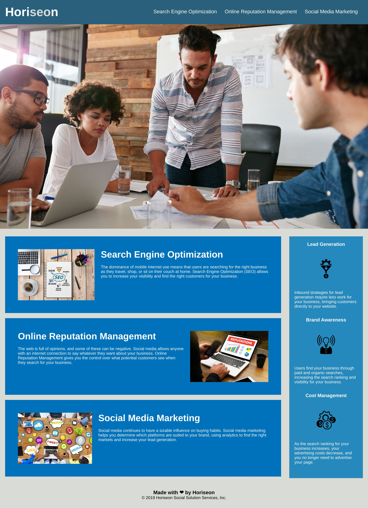

# bootcamp-week-1-challenge

## Description

Source code for bootcamp week 1 challenge in which we had to to refactor the html and css starter code to meet the acceptance criteria.

## User story

**AS A** marketing agency\
**I WANT** a codebase that follows accessibility standards\
**SO THAT** our own site is optimized for search engines

## Acceptance criteria

**GIVEN** a webpage meets accessibility standard\
**WHEN** I view the source code\
**THEN** I find semantic HTML elements\
**WHEN** I view the structure of the HTML elements\
**THEN** I find that the elements follow a logical structure independent of styling and positioning\
**WHEN** I view the image elements\
**THEN** I find accessible alt attributes\
**WHEN** I view the heading attributes\
**THEN** they fall in sequential order\
**WHEN** I view the title element\
**THEN** I find a concise, descriptive title\

## Live URL and screenshot

The project can be viewed live at this [url](https://anisha-sapkota.github.io/bootcamp-week-1-challenge/) and the screenshot below.

## Helpful resources

- <https://www.w3schools.com/accessibility/>
- <https://www.youtube.com/watch?v=ZThq93Yuwd0>
- <http://html5doctor.com/downloads/h5d-sectioning-flowchart.pdf>
- <https://cloudconvert.com/website-jpg-screenshot>
